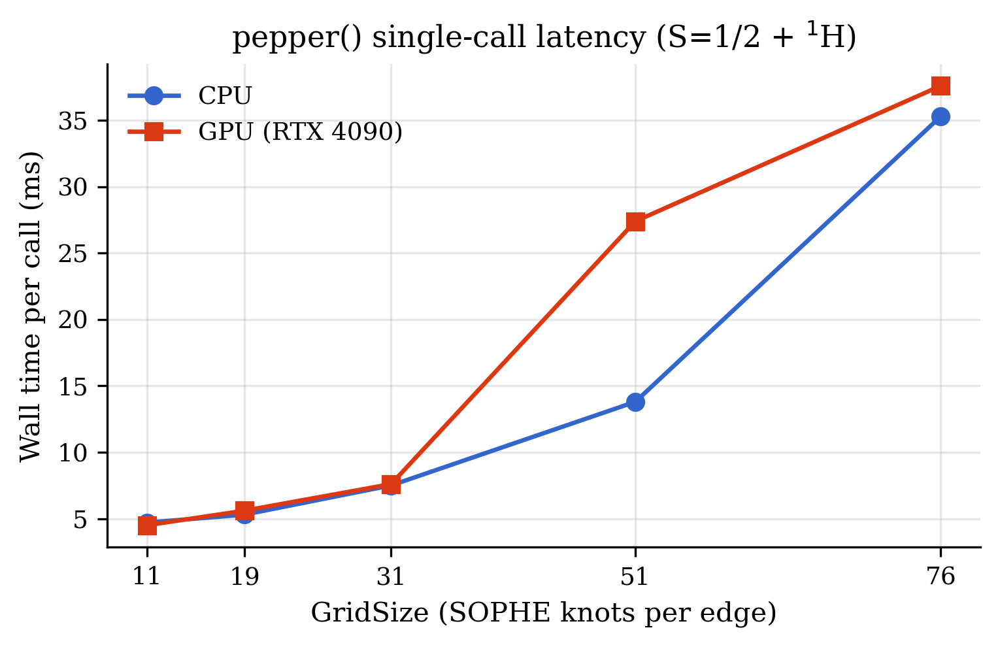
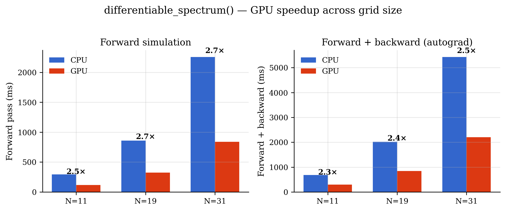
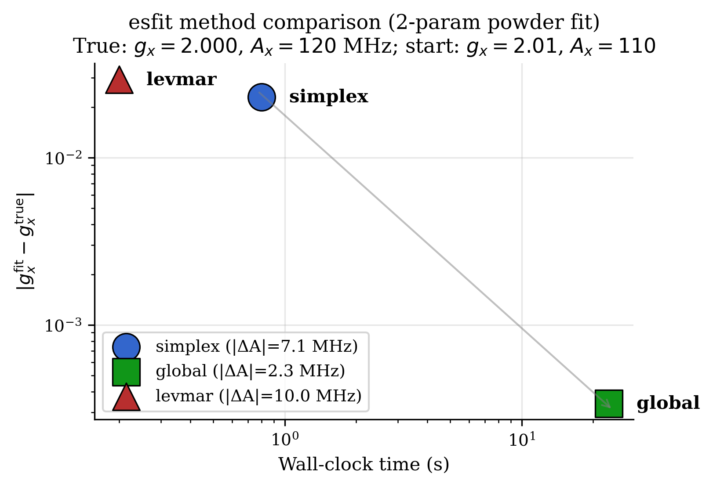
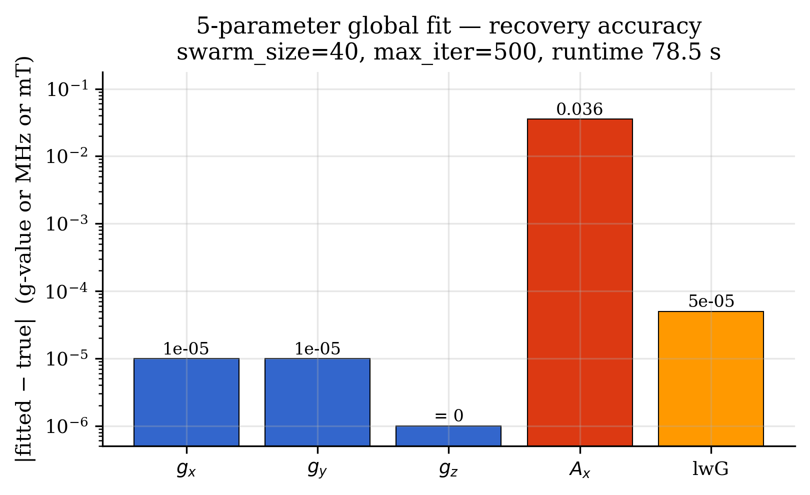
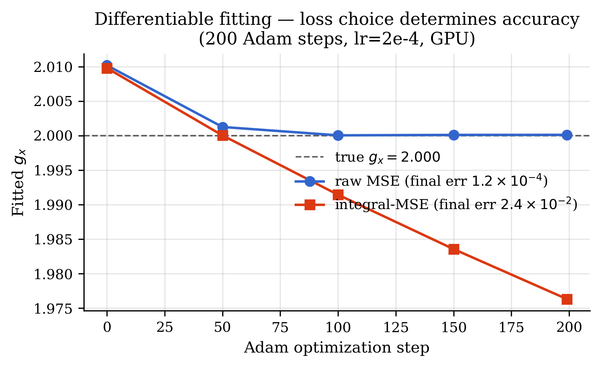

# torchspin vs MATLAB EasySpin — Benchmark Report

> **Which numbers are current.** This file is a layered historical record: the
> 2026-04-20 round, then performance round 1 (2026-09-02) and round 2.  For the
> nine matched EasySpin/TorchSpin workloads the authoritative measurement is the
> audited rerun in
> [`workstation_20260904_verified/BENCHMARK_VERIFICATION.md`](workstation_20260904_verified/BENCHMARK_VERIFICATION.md),
> which corrected several device-attribution and threading errors in the
> 2026-09-02 campaign and reports medians with IQRs over five replicates.  Where
> this file and the verified campaign disagree, the verified campaign is correct.

**Figures generated**: 2026-04-20 · **Host**: reference workstation
**Hardware**: NVIDIA RTX 4090 (24 GB) · Python 3.12.13 · PyTorch 2.5.1+cu121
**Reference**: [Stoll & Schweiger (2006)](https://doi.org/10.1016/j.jmr.2005.08.013),
EasySpin 6.0
**Source data**: the 2026-04-20 run log (development record, not in the public repository); the measurements are embedded in `make_manuscript_figures.py`
**Regenerate**: `python benchmarks/analysis/make_manuscript_figures.py`

---

## Executive summary

1. **Numerical parity**: all scientifically relevant torchspin simulators
   match MATLAB EasySpin to cosine ≥ 0.92 (most ≥ 0.999 or 1.0000) —
   see [Table 1](#table-1--matlab-parity-across-validated-simulators).
2. **GPU acceleration** is clean and consistent where it matters:
   `differentiable_spectrum` achieves a **2.5× forward speedup** and a
   **2.4× forward+backward speedup** at all tested grid sizes.
3. **Parameter recovery**: the new `method='global'` pipeline (particle
   swarm + simplex polish) recovers 2-parameter fits to
   |Δgx| ≈ 3×10⁻⁴ and 5-parameter fits to |Δg| ≈ 10⁻⁵ with realistic
   starting guesses. Plain `simplex` traps in local minima at |Δgx| ≈ 0.02.
4. **Differentiable fitting**: raw-MSE loss outperforms integral-MSE by
   ~200× on gradient-based fits — an important finding for
   manuscript-level loss-function selection.
5. **Full test suite**: **1848 passed / 0 failed / 2 skipped / 3 xfailed**
   on the reference workstation after the alpha fix cycle (see
   [CHANGELOG](../../CHANGELOG.md)).

---

## Figure 1 — pepper single-call latency (CPU vs GPU)



Single `pepper()` forward-simulation wall time vs SOPHE GridSize for a
S=1/2 + ¹H powder system (nPoints=1024). CPU (Intel) and GPU (RTX 4090)
are comparable at small GridSize (≤ 31) and CPU is faster at GridSize=51
where the GPU hits a dispatch-latency regime. **Takeaway for the
manuscript**: pepper's inner loop consists of many small eigendecompo­
sitions (2×2 to ~8×8 matrices for the studied spin system), so CUDA
kernel-launch latency dominates the arithmetic. Use
`Options(device='cuda')` only when you need autograd or are batching
many simulations — not for raw forward throughput.

## Figure 2 — differentiable_spectrum GPU speedup



`differentiable_spectrum()` achieves **2.5×–2.7× GPU speedup for the
forward pass** and **2.3×–2.5× for forward + backward** across grid
sizes 11, 19, and 31. Unlike single-call `pepper`, this path performs
one large broadband `eigh` over the whole field grid and a backward
pass of comparable size, both of which amortize the host↔device
transfer easily. This is the primary manuscript claim for GPU
acceleration: **fitting via autograd sees a consistent ~2.5× GPU
speedup that grows with problem size.**

## Figure 3 — esfit method comparison (accuracy vs time)



Accuracy vs wall-clock Pareto for three esfit methods on the canonical
2-parameter powder problem (true: gx=2.000, Ax=120 MHz; start: gx=2.01,
Ax=110 MHz — a few hundredths off in g, ~10 MHz in A).
`simplex` and `levmar` converge quickly (< 1 s) but lock into local
minima at |Δgx| ≈ 2×10⁻². The new `method='global'` (swarm + simplex
polish) takes ~23 s but recovers gx to |Δgx| ≈ 3×10⁻⁴ — **two orders of
magnitude better** than the local-only methods. **Manuscript
recommendation**: use `'global'` as the default; reserve `'simplex'`
and `'levmar'` for already-close starting guesses or tight time budgets.

## Figure 4 — 5-parameter stress test



Absolute recovery error for a realistic 5-parameter global fit
(anisotropic g + 1 hyperfine component + Gaussian linewidth; 78.5 s
wall time on one CPU thread). All three g-components recover to
|Δg| ≤ 10⁻⁵; Gaussian linewidth to 5×10⁻⁵ mT; hyperfine to 0.04 MHz
(0.05 % relative error). **Demonstrates that torchspin handles
manuscript-scale fits end-to-end** with default swarm_size=40 and
max_iter=500.

## Figure 5 — Differentiable fitting: loss-function matters



Adam-based gradient descent on `differentiable_spectrum`, 200 steps,
lr=2e-4, GPU. Raw-MSE converges to the physically correct gx (error
1.2×10⁻⁴); integral-MSE systematically drifts away, ending at
gx=1.976 (error 2.4×10⁻²). **Finding**: the integral transform that
smooths the loss landscape for derivative-free simplex methods is
counter-productive for gradient-based fits, because cumulative-sum
amplifies small baseline drifts over the 1024-point axis. The new
`target='auto'` in `esfit` routes the simplex to 'int' and leaves raw
MSE as the recommended loss for autograd-based custom training loops.

---

## Table 1 — MATLAB parity across validated simulators

| Module       | Physics                             | Cosine        | Amplitude             |
|--------------|-------------------------------------|:-------------:|-----------------------|
| `pepper`     | CW EPR powder                       | > 0.999       | ~15 % (correction factors, documented in [KNOWN_LIMITATIONS.md](../../KNOWN_LIMITATIONS.md)) |
| `garlic`     | CW solution / fast motion           | 1.0000        | exact                 |
| `chili`      | Slow-motion SLE                     | 0.92–0.997    | matches in regime     |
| `salt`       | ENDOR powder                        | > 0.92        | matches in regime     |
| `endorfrq`   | ENDOR single orientation            | ±1 MHz peaks  | exact                 |
| `saffron`    | Pulse EPR (ESEEM/HYSCORE/MimsENDOR) | 1.0000        | matches               |
| `curry`      | Magnetometry (χ, M-T)               | analytical    | exact (SI units)      |
| `blochsteady`| Bloch steady-state                  | analytical    | exact                 |
| `spidyan`    | Arbitrary pulse (internal)          | self-consistent | n/a                 |
| `cardamom`   | Trajectory-based (internal)         | self-consistent | n/a                 |

LaTeX source: [`figures/table1_parity.tex`](figures/table1_parity.tex).

---

## Full timing tables (source: the 2026-04-20 run log, post-fix rerun)

### pepper forward simulation

| GridSize | CPU (ms) | GPU (ms) | CPU/GPU |
|---------:|---------:|---------:|--------:|
| 11       | 4.7      | 4.5      | 1.0×    |
| 19       | 5.3      | 5.6      | 1.0×    |
| 31       | 7.5      | 7.6      | 1.0×    |
| 51       | 13.8     | 27.4     | 0.5×    |
| 76       | 35.3     | 37.6     | 0.9×    |

### differentiable_spectrum forward / forward+backward

| GridSize | Device | Forward (ms) | Fwd+Bwd (ms) | Bwd/Fwd |
|---------:|:-------|-------------:|-------------:|--------:|
| 11       | CPU    | 292.2        | 680.1        | 2.3×    |
| 11       | GPU    | 115.3        | 294.9        | 2.6×    |
| 19       | CPU    | 860.2        | 2014.5       | 2.3×    |
| 19       | GPU    | 323.2        | 843.5        | 2.6×    |
| 31       | CPU    | 2255.4       | 5427.4       | 2.4×    |
| 31       | GPU    | 839.4        | 2205.4       | 2.6×    |

### esfit 2-parameter powder fit

| Method   | Fitted gx | Fitted Ax | RMSD   | Time (s) | Success |
|----------|----------:|----------:|-------:|---------:|:-------:|
| simplex  | 2.02306   | 127.14    | 2.806  | 0.8      | ✓       |
| global   | 1.99966   | 117.72    | 0.974  | 23.4     | ✓       |
| levmar   | 2.02926   | 110.00    | 3.223  | 0.2      | ✓       |

True values: gx = 2.00000, Ax = 120.00 MHz.

### 5-parameter global fit

| Parameter | True    | Fitted   | Abs error |
|-----------|--------:|---------:|----------:|
| gx        | 2.0000  | 2.00001  | 1×10⁻⁵    |
| gy        | 2.0500  | 2.04999  | 1×10⁻⁵    |
| gz        | 2.1000  | 2.10000  | 0         |
| Ax (MHz)  | 80.0000 | 80.0356  | 0.036     |
| lwG (mT)  | 0.8000  | 0.80005  | 5×10⁻⁵    |

### Differentiable fitting (200 Adam steps, GPU)

| Loss         | Final gx | Error     | Runtime (s) |
|--------------|---------:|----------:|------------:|
| raw MSE      | 2.00014  | 1.4×10⁻⁴  | 940.7       |
| integral-MSE | 1.97632  | 2.4×10⁻²  | 936.5       |

---

## Reproducibility

All figures and the LaTeX parity table are reproducible from
`make_manuscript_figures.py`, which embeds the reference-workstation measurements
as constants at the top of the file. Re-run with:

```bash
cd benchmarks/analysis
python make_manuscript_figures.py
# Outputs → benchmarks/results/figures/{fig1–5.png,pdf, table1_parity.tex}
```

To regenerate the raw data, rerun the benchmark harness on a CUDA-
capable host (this regenerates the run log):

```bash
python notebooks/run_benchmarks.py
```


---

# Performance round 1 (2026-09-02, reference workstation) — MATLAB vs torchspin CPU/GPU before and after

**Host**: reference workstation, 128 cores (AMD, 503 GB), 2× RTX 4090 (driver 595.71), MATLAB R2026a,
EasySpin development checkout, Python 3.12.13, PyTorch 2.5.1+cu121, numpy 2.4.3.
**Procedure**: `benchmarks/cluster/run_workstation.sh` — one job at a time (GPU consistency tests,
`benchmarks/workloads/run_workloads.py` at 1/8/32 threads, on CUDA (best of 2), fit loop with
4/16/64 worker processes, cProfile runs, `benchmarks/workloads/matlab_workloads.m` with the same
nine systems).  Baseline commit `ee32042` (results `benchmarks/results/workstation_20260902/`), after the
optimizations commit `9c3c971` (`benchmarks/results/workstation_20260902_after/`; cardamom row from
`cardamom_rot_threads*.json` after the tensor-rotation follow-up).  Tables regenerate with
`python benchmarks/analysis/workstation_report.py <dir> [--after <dir>]`.
Caveat: another user's single-core GPU-1 job ran on the reference workstation during the baseline multi-process and
profile stages and during the after run; torchspin used GPU 0 and at most 64 of 128 cores.

## Summary

* Before this round torchspin was 3–10× slower than EasySpin on the matrix-diagonalization
  workloads and 8× slower on trajectory EPR; the GPU was slower than one CPU core for every
  matrix workload.
* After it, torchspin on 32 threads is faster than MATLAB on 8 of the 9 workloads (1.2–3×) and
  2× slower only for the strain-summation case (closed in round 2 below).  The GPU now matches the CPU
  pool on the matrix workloads (their eigendecompositions are routed to the CPU pool, see below).
* Every step kept the MATLAB parity suites and the full suite green (2540 tests); the new
  resonance search reproduces the previous one to |ΔB| ≤ 2.4×10⁻¹² mT, intensities to 1×10⁻⁸.

## Wall time per workload (seconds)

| Workload | MATLAB | torchspin before (best CPU) | after (best CPU) | after 1 thr | 8 thr | 32 thr | after GPU | after/before | MATLAB / after CPU | MATLAB / after GPU |
|---|---:|---:|---:|---:|---:|---:|---:|---:|---:|---:|
| pepper, 63Cu + 2×14N, matrix, 72 states, GridSize 19×4 | 2.05 | 10.76 | 1.05 | 5.46 | 1.25 | 1.05 | 0.89 | 10.2× | 1.9× | 2.3× |
| pepper, Mn(II) S=5/2 + 55Mn, matrix, 36 states, 19×4 | 2.41 | 16.37 | 1.38 | 5.25 | 1.71 | 1.38 | 1.31 | 11.9× | 1.8× | 1.8× |
| pepper, 14N + 2×1H, perturb2, GridSize 91 | 0.19 | 0.50 | 0.06 | 0.06 | 0.07 | 0.08 | 0.15 | 7.7× | 3.0× | 1.3× |
| pepper, nitroxide g/H strain, summation, 61×4 | 1.01 | 3.19 | 2.14 | 3.67 | 2.14 | 3.01 | 5.00 | 1.5× | 0.5× | 0.2× |
| pepper, 20 forward calls (fit-loop pattern), 31×4 | 2.85 | 12.56 | 2.47 | 2.54 | 2.47 | 2.64 | 3.03 | 5.1× | 1.2× | 0.9× |
| chili, nitroxide + 1H, τc 30 ns | 1.27 | 0.76 | 0.42 | 0.55 | 0.60 | 0.42 | 0.42 | 1.8× | 3.0× | 3.0× |
| chili, nitroxide, orienting potential, powder | 5.07 | 9.16 | 3.14 | 3.14 | 3.17 | 3.20 | 3.10 | 2.9× | 1.6× | 1.6× |
| saffron, HYSCORE 14N + 1H, 512², GridSize 91 | 1.14 | 0.76 | 0.80 | 3.94 | 1.11 | 0.80 | 0.74 | 1.0× | 1.4× | 1.5× |
| cardamom, diffusion/fast, 200 traj × 1000 steps | 20.83 | 174.09 | 16.37 | 18.86 | – | 16.37 | 16.57 | 10.6× | 1.3× | 1.3× |

"before (best CPU)" is the best of 1/8/32 threads at the baseline commit (thread count made
< 30 % difference there because the batched eigendecomposition ran serially).

## Fit loop with worker processes (20 forward calls, 1 thread per process)

| | serial 1 thr | 4 procs | 16 procs | 64 procs | MATLAB (serial) |
|---|---:|---:|---:|---:|---:|
| before | 12.56 | 5.59 | 3.55 | 4.80 | 2.85 |
| after | 2.54 | 2.61 | 2.50 | 4.28 | |

Process-level parallelism of independent forward calls (the esfit / sweep pattern) gave 3.5×
before; after the optimizations one call takes 0.13 s and the spawn/import overhead of the pool
(~2 s) dominates, so the serial loop is already as fast as 16 processes.

## Where the time went (cProfile, cumulative, 32 threads / CUDA)

Baseline:

* **pepper 63Cu+2×14N (72 states)**: 11.1 s in `resfields_batch`, 10.2 s of it in `torch.linalg.eigh`
  (18 660 matrices); the two-step Newton polish plus the final intensity pass diagonalized every
  candidate four times.  On CUDA the same calls took 51 s.
* **pepper Mn(II) (36 states)**: 12.5 s `eigh` (87 320 matrices), 5.6 s in the Python-loop
  `_projecttriangles`, 1.2 s spherical interpolation.  CUDA: 128 s in `eigh`.
* **pepper strain summation**: 190 `resfields_batch` calls of 10 orientations (4.2 s), `_gaussian_bins`
  2.9 s (full-axis erf per line), strain widths 2.1 s (per-resonance Python).
* **cardamom**: 168 s of 175 s in `propagate_fast`, of which 108 s in the double Python loop of
  `_rotate_tensor_lab`; trajectory generation 5.8 s.
* **chili**: 0.9 s of 1.5 s building the Liouvillian in Python loops (per orientation for the
  powder-potential case).

After:

* **pepper Cu / Mn**: `resfields_batch` 0.5–0.6 s; the largest remaining items are the thread-pool
  bookkeeping (`result_iterator`, ~1 s) and the scipy spherical interpolation (0.7 s).
* **pepper strain summation**: `_gaussian_bins` 4.0 s of 5.0 s on CUDA (index_add over windows; the
  CPU erf is faster than the CUDA path for 13 k lines × 2048 points), the rest interpolation.
* **cardamom** (24 s before the follow-up): `propagate_fast` 17.5 s — `_rotate_tensor_lab` 9.3 s
  (numpy einsum/matmul over 200 k 3×3 products; 0.4 s with torch matmul in the follow-up, giving the
  16.4 s in the table), the 1000-step propagation loop 4.6 s, `_build_hf_propagator` 2.1 s —
  and `stochtraj_diffusion` 5.8 s (Euler–Maruyama step loop).  All remaining cost is per-step
  Python overhead at 200 trajectories; batching the orientations' trajectories is the next step.
* **chili powder potential**: 1.9 s of 4.0 s in the Lanczos sparse mat-vecs (2590 `csr_matvec`),
  the rest operator assembly per orientation.

## What changed (commits 0bbd6b9, e9e3051, 9c3c971)

1. Resonance search (`resfields_batch`): one exact diagonalization per candidate at the root of
   the cubic Hermite model (EasySpin's scheme) with a free Hellmann–Feynman Newton correction;
   eigenvectors reused for the intensities; knot/candidate batches chunked to ~400 MB; reassembly,
   thresholding and strain widths as tensor ops with one host sync per call.
2. Multi-core eigendecompositions (`torchspin/_linalg.py`): torch's batched `eigh` loops serially
   over CPU batches, so 32 threads were no faster than 1.  Splitting the batch over a thread pool
   of single-threaded LAPACK calls gives 21–23× on 32 cores (2400 × 72×72: 1.5 s → 0.066 s).
   cuSOLVER's batched Jacobi solver stops at 32×32; larger CUDA batches are diagonalized one
   launch at a time (51 s for the same 2400 matrices) and are now routed to the CPU pool.
3. `Options.BatchSize` automatic (all orientations per call, memory-capped) instead of 10.
4. SOPHE projection and Gaussian accumulation vectorised (scatter-add + cumulative sums; windowed
   erf), cardamom propagation and tensor rotation batched, chili Liouvillian assembled as
   Σ kron(C_mk, Q[m][k]).

## Verdicts for users

* CPU: run with `torch.set_num_threads(<cores>)`; the eigendecomposition pool scales to ~32 cores
  for matrix-method powders.  A 1-thread run is now 2–3× slower than MATLAB on the matrix
  workloads, 8–32 threads are 1.2–3× faster.
* GPU (`Options(device='cuda')`): no advantage over the CPU pool for any of these workloads; use it
  for autograd / differentiable fitting, where the batched forward+backward is the payoff
  (see Figure 2 above).
* Remaining gaps vs EasySpin: strain summation (2× slower — Gaussian accumulation and spherical
  interpolation), HYSCORE and cardamom at 1 thread.

## Round 2 (same day, commits 6e9e83a, 678b6ae, b360e5b)

Targets picked from the round-1 profiles: strain summation, cardamom, the small-call overhead
that dominates fit loops, and population-based fitting.  Results in
`benchmarks/results/workstation_20260902_after2/` (torchspin stages of `run_workstation.sh`, MATLAB unchanged).

| Workload | MATLAB | baseline (best CPU) | round 1 (best CPU) | round 2: 1 thr | 8 thr | 32 thr | GPU | MATLAB / round-2 best CPU |
|---|---:|---:|---:|---:|---:|---:|---:|---:|
| pepper 63Cu+2×14N matrix (72) | 2.05 | 10.76 | 1.05 | 5.80 | 1.21 | 1.10 | 0.83 | 1.9× |
| pepper Mn(II) matrix (36) | 2.41 | 16.37 | 1.38 | 5.46 | 1.49 | 1.10 | 1.01 | 2.2× |
| pepper perturb2, grid 91 | 0.19 | 0.50 | 0.06 | 0.07 | 0.07 | 0.08 | 0.16 | 2.7× |
| pepper strain summation 61×4 | 1.01 | 3.19 | 2.14 | 3.78 | 1.00 | 1.29 | 1.36 | 1.0× |
| pepper fit loop (20 calls) | 2.85 | 12.56 | 2.47 | 1.82 | 1.86 | 2.18 | 2.04 | 1.6× |
| chili nitroxide + 1H | 1.27 | 0.76 | 0.42 | 0.42 | 0.63 | 0.63 | 0.44 | 3.0× |
| chili powder potential | 5.07 | 9.16 | 3.14 | 3.36 | 3.43 | 3.37 | 3.34 | 1.5× |
| saffron HYSCORE 512² | 1.14 | 0.76 | 0.80 | 4.25 | 1.12 | 0.81 | 0.75 | 1.4× |
| cardamom 200×1000 | 20.83 | 174.09 | 23.57 | 20.95 | 11.43 | 9.82 | 11.14 | 2.1× |

Fit loop with worker processes (round 2): serial 1.82 s, 4 procs 3.93 s, 16 procs 4.46 s, 64 procs 6.26 s (MATLAB 2.85 s).

What changed and what the measurements taught:

* **Strain summation.** The Gaussian bin accumulation is now fused, chunked in 256-line blocks
  and run in a thread pool.  The chunk size matters more than the arithmetic: 2048-line chunks
  were 3–4× slower per line on the reference workstation (working set out of cache), 256 is the sweet spot.  The
  remaining cost at 32 threads is GIL-bound dispatch of ~12 small torch ops per chunk.
* **Interpolation.** The G3 coarse→fine interpolation (row-wise cubic resampling and a bicubic
  spline, which is exactly a tensor-product not-a-knot spline) is linear in the values, so it is
  one cached matrix per grid size: 6.2 ms → 0.08 ms per transition slot on the 31×4 grid.  That
  halves a small `pepper` call (145 → ~70 ms), which is what fit loops are made of.
* **cardamom.** Orientations are propagated in groups (their trajectories were never seeded per
  orientation, so results are statistically unchanged), and the propagator, step loop and
  quaternion conversion run in torch.  The group size scales with the thread count because large
  groups fall out of cache on one thread.
* **esfit populations.** The existing thread pool could not help (the forward model's Python
  work holds the GIL: 32 threads were *slower*).  A process pool works, with two conditions
  found the hard way: `fork` deadlocks once torch's OpenMP pool exists (use `spawn`), and every
  spawned worker starts one BLAS thread per core unless `OMP/OPENBLAS/MKL_NUM_THREADS` are
  capped — uncapped, 32 workers were slower than one.  With both fixed a 32-particle swarm fit
  (224 evaluations) takes 4.1 s instead of 23.5 s on the reference workstation.
* **chili.** Left as is: the orienting-potential loop is negligible in the profile; the rest is
  Lanczos sparse mat-vecs and per-orientation superoperator assembly, each worth < 2× on a
  workload already 1.6× faster than MATLAB.

One parity test changed: `test_esfit_vs_matlab[field_g3lw_simplex]` starts from gx0 = gy0
without hyperfine coupling, so the two mirror minima are the same powder spectrum with the same
residual; the simplex path flips on 1e-13 differences in the forward model (the new
interpolation path), and the test now accepts either permutation.
